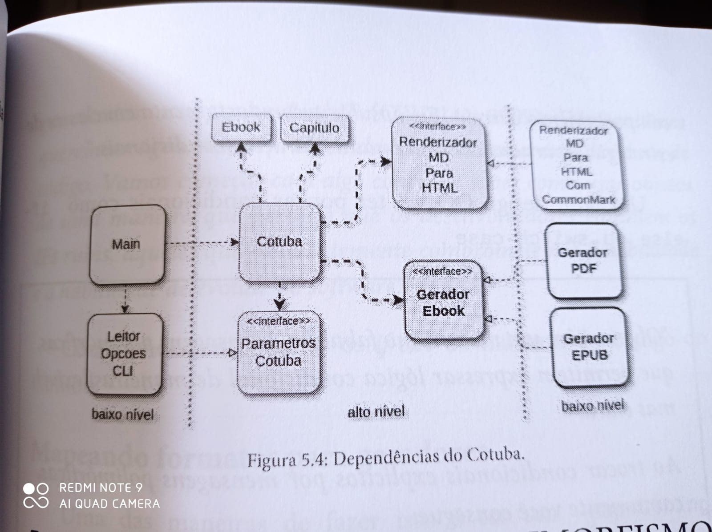

# desbravando-solid
repositorio do codigo do livro desbravando solid da casa do codigo

começamos com um sistema que estava todo na classe [Main](https://github.com/alexandreaquiles/desbravando-solid/blob/main/cotuba/src/main/java/cotuba/Main.java)
a primeira refatoração foi quebrar a main em 3 partes, e definir 3 classes:

após diversas melhorias no design, o cotuba ficou com esta arquitetura, ainda monolitica:

o código desta arquitetura está no diretório **cotuba/**

clientes externos queriam de alguma forma modificar um comportamento do cotuba, como não podemos acatar todos os pedidos, criamos plugins:

o código dos plugins estão no diretório:
**cognito/estatisticas-ebook**
**paradizo/paradizo**

o último passo foi deixar o monolito do cotuba modularizado, e com arquitetura hexagonal:

o código do cotuba modular está no diretório **cotuba-module/** 
